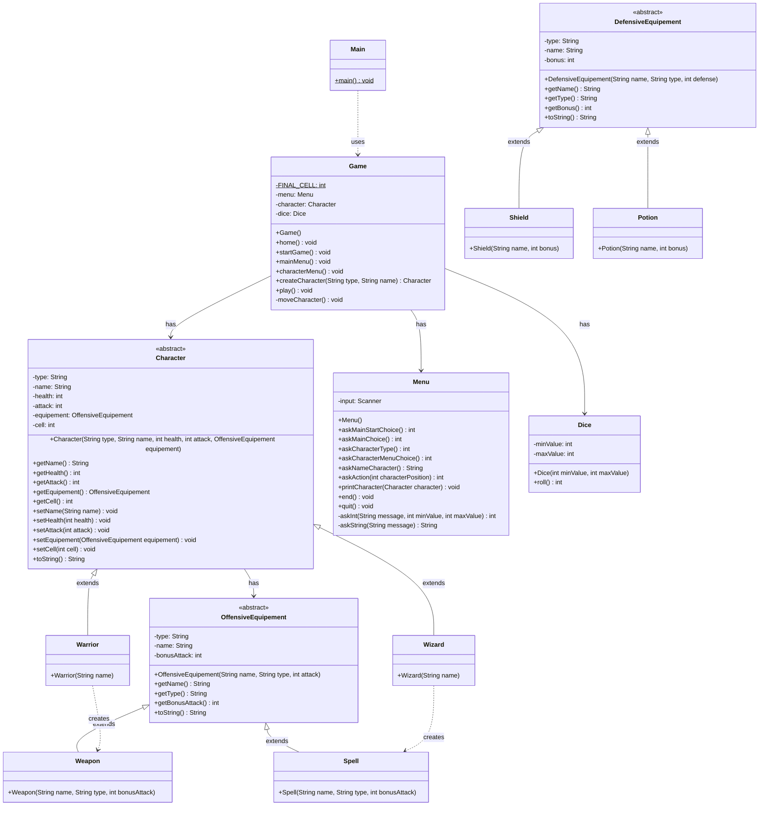

# Brumelame

Un jeu de rôle en ligne de commande développé en Java.

## Structure du projet

```
src/
├── fr/neri/brumelame/
│   ├── app/
│   │   └── Main.java
│   ├── domain/
│   │   ├── Character.java
│   │   ├── DefensiveEquipement.java
│   │   ├── OffensiveEquipement.java
│   │   ├── Potion.java
│   │   ├── Shield.java
│   │   ├── Spell.java
│   │   ├── Warrior.java
│   │   ├── Weapon.java
│   │   └── Wizard.java
│   ├── game/
│   │   ├── Dice.java
│   │   └── Game.java
│   └── ui/
│       └── Menu.java
```

## Diagramme de classes



## Comment jouer

1. Compiler le projet
2. Exécuter [`Main.java`](src/fr/neri/brumelame/app/Main.java)
3. Suivre les instructions à l'écran :
   - Créer un personnage (Sorcier ou Guerrier)
   - Nommer votre personnage
   - Commencer le jeu et avancer sur le plateau (64 cases)

## Classes principales

- [`Game`](src/fr/neri/brumelame/game/Game.java) : Gère la logique du jeu
- [`Character`](src/fr/neri/brumelame/domain/Character.java) : Classe abstraite pour les personnages
- [`Warrior`](src/fr/neri/brumelame/domain/Warrior.java) : Classe guerrier (10 PV, 5 ATK)
- [`Wizard`](src/fr/neri/brumelame/domain/Wizard.java) : Classe sorcier (6 PV, 8 ATK)
- [`Menu`](src/fr/neri/brumelame/ui/Menu.java) : Gère l'interface utilisateur
- [`Dice`](src/fr/neri/brumelame/game/Dice.java) : Simule un dé pour le déplacement
