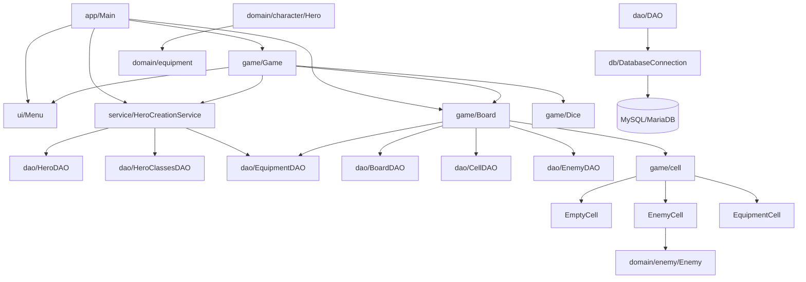

# Brumelame

Brumelame est un jeu de rôle en ligne de commande développé en Java. Le joueur crée un héros, avance sur un plateau de 64 cases, rencontre des ennemis, récupère des équipements et tente d’atteindre la dernière case en restant en vie.

Le projet utilise une base MySQL/MariaDB pour initialiser les données du jeu : classes de héros, ennemis, équipements, plateau, cases et héros créés.

## Fonctionnalités

- Création d’un héros avec choix de classe : **Warrior** ou **Wizard**.
- Chargement des caractéristiques de classe depuis la base de données.
- Équipement initial automatique selon la classe du héros.
- Plateau de 64 cases généré en base au lancement d’une partie.
- Cases vides, cases ennemis et cases équipements.
- Combats au tour par tour contre des ennemis.
- Équipements offensifs, défensifs et consommables.
- Potions de soin et récupération de vie sur certaines cases vides.
- Interface entièrement en ligne de commande.

## Stack technique

- Java 17+ recommandé.
- JDBC.
- MySQL Connector/J.
- MySQL ou MariaDB.
- Docker Compose pour lancer la base en local.

## Structure du projet

```text
.
├── README.md
├── docker-compose.example.yml
├── init.sql
└── src/
    ├── resources/
    │   └── db.properties.example
    └── fr/neri/brumelame/
        ├── app/
        │   └── Main.java
        ├── dao/
        │   ├── BoardDAO.java
        │   ├── CellDAO.java
        │   ├── DAO.java
        │   ├── EnemyDAO.java
        │   ├── EquipmentDAO.java
        │   ├── HeroClassesDAO.java
        │   └── HeroDAO.java
        ├── db/
        │   └── DatabaseConnection.java
        ├── domain/
        │   ├── character/
        │   │   ├── Hero.java
        │   │   ├── HeroClasse.java
        │   │   ├── Warrior.java
        │   │   └── Wizard.java
        │   ├── enemy/
        │   │   └── Enemy.java
        │   └── equipment/
        │       ├── Barrier.java
        │       ├── ConsumableEquipment.java
        │       ├── DefensiveEquipment.java
        │       ├── Equipment.java
        │       ├── OffensiveEquipment.java
        │       ├── Potion.java
        │       ├── Shield.java
        │       ├── Spell.java
        │       └── Weapon.java
        ├── exception/
        │   ├── BoardInitializationException.java
        │   └── HeroInitializationException.java
        ├── game/
        │   ├── Board.java
        │   ├── Dice.java
        │   ├── Game.java
        │   └── cell/
        │       ├── Cell.java
        │       ├── EmptyCell.java
        │       ├── EnemyCell.java
        │       └── EquipmentCell.java
        ├── service/
        │   └── HeroCreationService.java
        └── ui/
            └── Menu.java
```

## Architecture



## Prérequis

- JDK 17 ou plus récent.
- Docker et Docker Compose, si vous utilisez la base fournie en local.
- MySQL Connector/J disponible localement pour lancer l’application sans Maven/Gradle.

Exemple d’emplacement pour le driver JDBC :

```text
lib/mysql-connector-j-<version>.jar
```

## Comment jouer

Au lancement, le jeu affiche un menu principal :

1. Créer un nouveau personnage.
2. Choisir une classe : `Wizard` ou `Warrior`.
3. Donner un nom au héros.
4. Consulter les caractéristiques du héros ou commencer la partie.
5. Avancer sur le plateau jusqu’à la dernière case.

Pendant la partie :

- Une case vide peut permettre au héros de récupérer 1 point de vie s’il n’est pas déjà au maximum.
- Une case équipement propose de récupérer ou d’utiliser l’objet trouvé.
- Une case ennemi déclenche un combat au tour par tour.
- La partie est gagnée lorsque le héros atteint la dernière case.
- La partie est perdue lorsque les points de vie du héros tombent à 0 ou moins.

## Règles et données initiales

Les données de base sont définies dans `init.sql`.

### Classes de héros

| Classe | PV de base | Attaque de base | Équipement offensif |
|---|---:|---:|---|
| `WARRIOR` | 10 | 5 | `WEAPON` |
| `WIZARD` | 6 | 8 | `SPELL` |

### Ennemis

| Ennemi | PV | Attaque |
|---|---:|---:|
| `gobelin` | 6 | 1 |
| `sorcier` | 9 | 2 |
| `dragon` | 15 | 4 |

### Équipements

| Type | Catégorie | Exemples |
|---|---|---|
| `ATTACK` | `WEAPON` | Épée de bois, Épée de fer, Épée en acier |
| `ATTACK` | `SPELL` | Bâton de marche, Bâton d’éclair de mana, Bâton de boule de feu |
| `DEFENSE` | `WEAPON` | Bouclier de fer |
| `DEFENSE` | `SPELL` | Bouclier de mana |
| `CONSUMABLE` | `POTION` | Petite potion de vie, Grande potion de vie |

