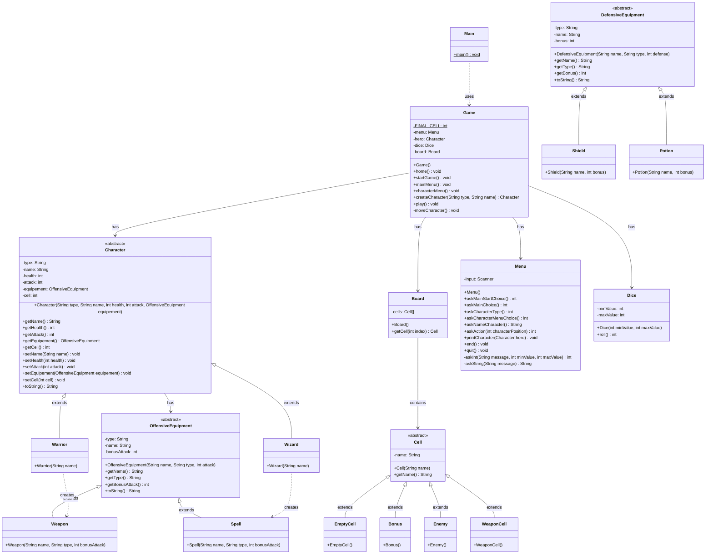

# Brumelame

Un jeu de rôle en ligne de commande développé en Java.

## Structure du projet

```
src/
├── fr/neri/brumelame/
│   ├── app/
│   │   └── Main.java
│   ├── domain/
│   │   ├── hero/
│   │   │   ├── Character.java
│   │   │   ├── Warrior.java
│   │   │   └── Wizard.java
│   │   └── equipment/
│   │       ├── DefensiveEquipment.java
│   │       ├── OffensiveEquipment.java
│   │       ├── Potion.java
│   │       ├── Shield.java
│   │       ├── Spell.java
│   │       └── Weapon.java
│   ├── game/
│   │   ├── Board.java
│   │   ├── Dice.java
│   │   ├── Game.java
│   │   └── cell/
│   │       ├── Bonus.java
│   │       ├── Cell.java
│   │       ├── EmptyCell.java
│   │       ├── Enemy.java
│   │       └── WeaponCell.java
│   └── ui/
│       └── Menu.java
```

## Diagramme de classes



## Comment jouer

1. Compiler le projet
2. Exécuter [`Main.java`](src/fr/neri/brumelame/app/Main.java)
3. Suivre les instructions à l'écran :
   - Créer un personnage (Sorcier ou Guerrier)
   - Nommer votre personnage
   - Commencer le jeu et avancer sur le plateau (64 cases)
   - Rencontrer des cases spéciales : bonus, ennemis, armes...

## Classes principales

### Application
- [`Main`](src/fr/neri/brumelame/app/Main.java) : Point d'entrée de l'application

### Personnages (`domain/hero`)
- [`Character`](src/fr/neri/brumelame/domain/hero/Character.java) : Classe abstraite pour les personnages
- [`Warrior`](src/fr/neri/brumelame/domain/hero/Warrior.java) : Classe guerrier (10 PV, 5 ATK)
- [`Wizard`](src/fr/neri/brumelame/domain/hero/Wizard.java) : Classe sorcier (6 PV, 8 ATK)

### Équipements (`domain/equipment`)
- [`OffensiveEquipment`](src/fr/neri/brumelame/domain/equipment/OffensiveEquipment.java) : Classe abstraite pour les équipements offensifs
- [`Weapon`](src/fr/neri/brumelame/domain/equipment/Weapon.java) : Arme pour les guerriers
- [`Spell`](src/fr/neri/brumelame/domain/equipment/Spell.java) : Sort pour les sorciers
- [`DefensiveEquipment`](src/fr/neri/brumelame/domain/equipment/DefensiveEquipment.java) : Classe abstraite pour les équipements défensifs
- [`Shield`](src/fr/neri/brumelame/domain/equipment/Shield.java) : Bouclier
- [`Potion`](src/fr/neri/brumelame/domain/equipment/Potion.java) : Potion de soin

### Jeu (`game`)
- [`Game`](src/fr/neri/brumelame/game/Game.java) : Gère la logique du jeu
- [`Board`](src/fr/neri/brumelame/game/Board.java) : Représente le plateau de jeu
- [`Dice`](src/fr/neri/brumelame/game/Dice.java) : Simule un dé pour le déplacement

### Cases (`game/cell`)
- [`Cell`](src/fr/neri/brumelame/game/cell/Cell.java) : Classe abstraite pour les cases du plateau
- [`EmptyCell`](src/fr/neri/brumelame/game/cell/EmptyCell.java) : Case vide
- [`Bonus`](src/fr/neri/brumelame/game/cell/Bonus.java) : Case bonus
- [`Enemy`](src/fr/neri/brumelame/game/cell/Enemy.java) : Case ennemi
- [`WeaponCell`](src/fr/neri/brumelame/game/cell/WeaponCell.java) : Case arme

### Interface utilisateur (`ui`)
- [`Menu`](src/fr/neri/brumelame/ui/Menu.java) : Gère l'interface utilisateur en ligne de commande


mkdir out
javac -d out $(find src -name "*.java")
cd out
jar cvf fr.neri.brumelame.jar .
java -cp fr.neri.brumelame.jar fr.neri.brumelame.app.Main
